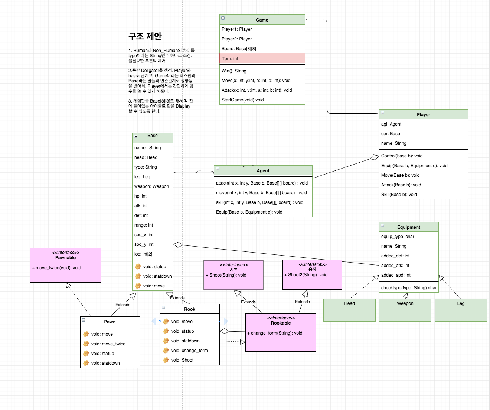

## 로봇체스


### UML




### DB 연동하는 방법

#### Horse Model

| name | type   | hp   | atk  | def  | hrange | spdX | spdY |
| ---- | ------ | ---- | ---- | ---- | ----- | ---- | ---- |
| 폰   | 인간형 | 150  | 10   | 0    | 1     | 1    | 1    |
| 폰   | 기계형 | 160  | 15   | 3    | 1     | 1    | 1    |
| 룩   | 인간형 | 100  | 30   | 2    | 2     | 3    | 3    |
| 룩   | 기계형 | 110  | 35   | 5    | 2     | 3    | 3    |
| 킹   | 인간형 | 250  | 5    | 0    | 1     | 1    | 1    |

#### User Model

| id | name   | total   | win  | lose  |
| ---- | ------ | ---- | ---- | ---- |
| int | varchar(20)   | int  | int  | int  |

#### DTO

데이터베이스 DTO(Data Transfer Object)객체를 `Horse.java` , `User.java` 로 구현함!
데이터베이스의 애트리뷰트값을 getter와 setter로 가져올 수 있도록!

#### DAO

DAO는 Data Access Object의 줄임말로 데이터베이스에 연결해 필요한 로직을 수행하는 클래스이다.

- `DAO.java` => Horse관련 로직
- `UDao.java` => User관련 로직

기본적으로 여기서는 javaproject라는 Database를 먼저 생성했다.

```sql
> CREATE DATABASE javaproject;
```

각자 mysql에 접속한 후에 javaproject 데이터베이스를 사용한다고 해줘야한다.

```sql
> USE javaproject;
```

DAO클래스 내부를 보면

```java
String driver = "com.mysql.jdbc.Driver";
String url = "jdbc:mysql://localhost:3306/javaproject";
String uid = "사용자이름";
String upw = "비밀번호";
```

코드에 각자 데이터베이스 접속할때 사용하는 사용자 이름과 비밀번호를 입력해주면된다!
DAO 내부에 데이터베이스 테이블 생성, 컬럼 생성, select 함수를 만들어두었다!

#### Game.java

Main 함수가 있는 `Game.java`내부에

```java
	public static void main(String args[]) {
		// 테이블 생성 및 레코드 추가
//		DAO dao = new DAO();
//		dao.createHorse();
//		dao.insert_record();
```
주석처리를 해두었다. 처음에 테이블을 생성하고 값을 넣을때에만 주석을 풀고 실행해주면된다!

즉, 각자 변경해줘야할 부분은 uid, upw 부분이고, 기본적으로 javaproject database생성만 해주면된다.!

#### UserTest.java

User 관련실행방법은 `UserTest.java` 에 올렸음!

### 역할분담

| 역할          | 팀원                   |
| ------------- | ---------------------- |
| GUI( Client ) | 고길재, 임창빈         |
| Server        | 박성준, 정다혜, 최지원 |

